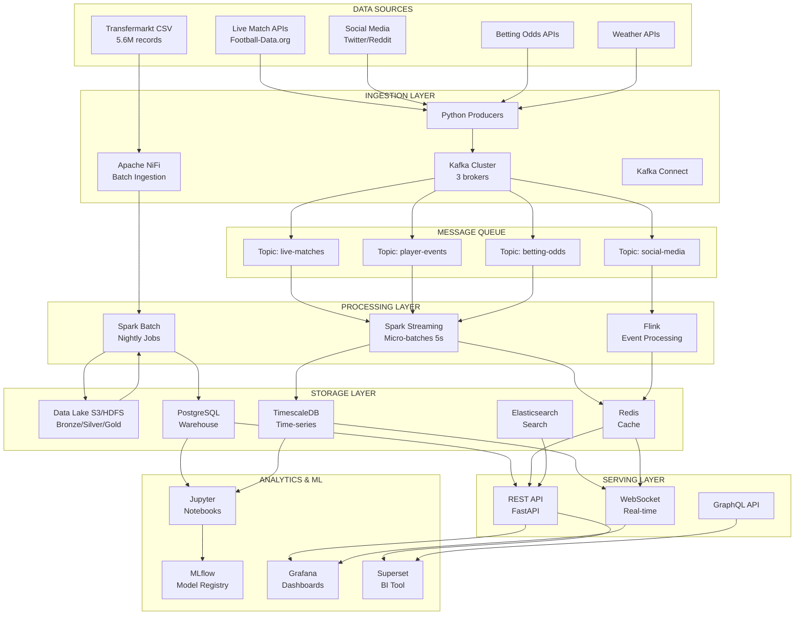

# 🏗️ KIẾN TRÚC HỆ THỐNG CHI TIẾT

## 1. LAMBDA ARCHITECTURE - DETAILED DESIGN



## 2. DATA FLOW ARCHITECTURE

### 2.1 Batch Processing Flow

```
┌──────────────────────────────────────────────────────────────┐
│ DAILY BATCH PROCESS (Airflow DAG)                            │
├──────────────────────────────────────────────────────────────┤
│                                                               │
│  01:00 AM - Extract                                          │
│  ├─ Read CSV files from datalake/                           │
│  ├─ Validate file integrity                                  │
│  └─ Load to Spark DataFrame                                  │
│                                                               │
│  02:00 AM - Transform                                        │
│  ├─ Data quality checks                                      │
│  ├─ Remove duplicates                                        │
│  ├─ Handle missing values                                    │
│  ├─ Feature engineering                                      │
│  │  ├─ Player form metrics (last 5 games)                   │
│  │  ├─ Team strength ratings                                 │
│  │  ├─ Market value trends                                   │
│  │  └─ Injury risk scores                                    │
│  └─ Calculate aggregations                                   │
│                                                               │
│  04:00 AM - Load                                             │
│  ├─ Write to Data Warehouse (PostgreSQL)                    │
│  ├─ Update cache (Redis)                                     │
│  ├─ Index in Elasticsearch                                   │
│  └─ Archive to Data Lake (Parquet)                          │
│                                                               │
│  05:00 AM - ML Pipeline                                      │
│  ├─ Retrain models on new data                              │
│  ├─ Validate model performance                               │
│  ├─ Update model registry (MLflow)                          │
│  └─ Deploy to production                                     │
│                                                               │
│  06:00 AM - Reporting                                        │
│  ├─ Generate daily reports                                   │
│  ├─ Send email notifications                                 │
│  └─ Update dashboards                                        │
│                                                               │
└──────────────────────────────────────────────────────────────┘
```

### 2.2 Streaming Processing Flow

```
┌──────────────────────────────────────────────────────────────┐
│ REAL-TIME STREAM PROCESSING                                  │
├──────────────────────────────────────────────────────────────┤
│                                                               │
│  API Producers (Every 5 seconds)                             │
│  ├─ Football-Data API → Kafka Topic: live-matches           │
│  ├─ Twitter Stream → Kafka Topic: social-media              │
│  ├─ Betting API → Kafka Topic: betting-odds                 │
│  └─ Weather API → Kafka Topic: weather-data                 │
│                                                               │
│  Stream Processing (Spark Streaming - 5s micro-batches)     │
│  ├─ Consume from Kafka                                       │
│  ├─ Parse & validate JSON                                    │
│  ├─ Enrich with historical data                             │
│  │  ├─ Join with player profiles                            │
│  │  ├─ Join with team stats                                 │
│  │  └─ Calculate real-time metrics                          │
│  ├─ Apply ML models                                          │
│  │  ├─ Predict match outcome                                │
│  │  ├─ Detect anomalies                                     │
│  │  └─ Sentiment analysis                                    │
│  └─ Output to multiple sinks                                 │
│                                                               │
│  Storage & Serving (< 1 second latency)                     │
│  ├─ Hot data → Redis (TTL: 1 hour)                          │
│  ├─ Warm data → TimescaleDB (1 month retention)            │
│  ├─ Cold data → S3 (long-term archive)                      │
│  └─ WebSocket push to dashboards                            │
│                                                               │
│  Alerting & Notifications                                    │
│  ├─ Goal scored → Push notification                         │
│  ├─ Odds spike → Alert traders                              │
│  ├─ Trending topic → Update dashboard                       │
│  └─ System anomaly → Slack alert                            │
│                                                               │
└──────────────────────────────────────────────────────────────┘
```

## 3. DATA LAKE STRUCTURE (Medallion Architecture)

```
datalake/
├── bronze/                          # Raw data (unchanged)
│   ├── transfermarkt/
│   │   ├── player_profiles/
│   │   ├── player_performances/
│   │   └── ...
│   ├── live_matches/
│   │   ├── year=2025/
│   │   │   ├── month=11/
│   │   │   │   ├── day=24/
│   │   │   │   │   └── matches_*.json
│   ├── social_media/
│   │   └── tweets_*.json
│   └── betting_odds/
│       └── odds_*.json
│
├── silver/                          # Cleaned & validated
│   ├── players/
│   │   ├── profiles.parquet
│   │   ├── stats_by_season.parquet
│   │   └── market_values.parquet
│   ├── teams/
│   │   ├── team_info.parquet
│   │   └── season_stats.parquet
│   ├── matches/
│   │   ├── fixtures.parquet
│   │   ├── results.parquet
│   │   └── events.parquet
│   └── social/
│       ├── processed_tweets.parquet
│       └── sentiment_scores.parquet
│
└── gold/                            # Business-ready aggregates
    ├── analytics/
    │   ├── player_rankings.parquet
    │   ├── team_power_ratings.parquet
    │   ├── transfer_market_analysis.parquet
    │   └── injury_risk_scores.parquet
    ├── ml_features/
    │   ├── player_features.parquet
    │   ├── team_features.parquet
    │   └── match_features.parquet
    └── reports/
        ├── daily_summary.parquet
        ├── weekly_insights.parquet
        └── monthly_trends.parquet
```

## 4. DATABASE SCHEMA (PostgreSQL)

### 4.1 Core Tables

```sql
-- Dimension Tables
CREATE TABLE dim_players (
    player_id BIGINT PRIMARY KEY,
    player_name VARCHAR(255),
    date_of_birth DATE,
    nationality VARCHAR(100),
    position VARCHAR(50),
    current_club_id BIGINT,
    market_value DECIMAL(12,2),
    updated_at TIMESTAMP
);

CREATE TABLE dim_teams (
    team_id BIGINT PRIMARY KEY,
    team_name VARCHAR(255),
    country VARCHAR(100),
    league_id BIGINT,
    stadium VARCHAR(255),
    updated_at TIMESTAMP
);

CREATE TABLE dim_competitions (
    competition_id BIGINT PRIMARY KEY,
    competition_name VARCHAR(255),
    country VARCHAR(100),
    tier INT,
    season VARCHAR(10)
);

-- Fact Tables
CREATE TABLE fact_player_performances (
    performance_id BIGSERIAL PRIMARY KEY,
    player_id BIGINT REFERENCES dim_players(player_id),
    team_id BIGINT REFERENCES dim_teams(team_id),
    competition_id BIGINT REFERENCES dim_competitions(competition_id),
    match_date DATE,
    season VARCHAR(10),
    minutes_played INT,
    goals INT,
    assists INT,
    yellow_cards INT,
    red_cards INT,
    rating DECIMAL(3,2),
    created_at TIMESTAMP DEFAULT NOW()
);

CREATE TABLE fact_transfers (
    transfer_id BIGSERIAL PRIMARY KEY,
    player_id BIGINT REFERENCES dim_players(player_id),
    from_team_id BIGINT REFERENCES dim_teams(team_id),
    to_team_id BIGINT REFERENCES dim_teams(team_id),
    transfer_date DATE,
    transfer_fee DECIMAL(12,2),
    contract_duration INT,
    created_at TIMESTAMP DEFAULT NOW()
);

CREATE TABLE fact_injuries (
    injury_id BIGSERIAL PRIMARY KEY,
    player_id BIGINT REFERENCES dim_players(player_id),
    injury_type VARCHAR(255),
    injury_date DATE,
    return_date DATE,
    days_missed INT,
    games_missed INT,
    created_at TIMESTAMP DEFAULT NOW()
);

-- Analytics Tables
CREATE TABLE player_form_metrics (
    player_id BIGINT REFERENCES dim_players(player_id),
    calculation_date DATE,
    last_5_games_avg_rating DECIMAL(3,2),
    last_5_games_goals INT,
    last_5_games_assists INT,
    form_trend VARCHAR(20), -- 'improving', 'declining', 'stable'
    PRIMARY KEY (player_id, calculation_date)
);

CREATE TABLE team_strength_ratings (
    team_id BIGINT REFERENCES dim_teams(team_id),
    calculation_date DATE,
    attack_rating DECIMAL(5,2),
    defense_rating DECIMAL(5,2),
    overall_rating DECIMAL(5,2),
    league_rank INT,
    PRIMARY KEY (team_id, calculation_date)
);
```

### 4.2 TimescaleDB Hypertables (Time-series data)

```sql
-- Live match events
CREATE TABLE live_match_events (
    event_id BIGSERIAL,
    match_id BIGINT,
    event_timestamp TIMESTAMPTZ NOT NULL,
    event_type VARCHAR(50), -- 'goal', 'card', 'substitution'
    player_id BIGINT,
    team_id BIGINT,
    minute INT,
    details JSONB,
    PRIMARY KEY (event_id, event_timestamp)
);

SELECT create_hypertable('live_match_events', 'event_timestamp');

-- Real-time betting odds
CREATE TABLE betting_odds_stream (
    odds_id BIGSERIAL,
    match_id BIGINT,
    timestamp TIMESTAMPTZ NOT NULL,
    home_odds DECIMAL(5,2),
    draw_odds DECIMAL(5,2),
    away_odds DECIMAL(5,2),
    bookmaker VARCHAR(100),
    PRIMARY KEY (odds_id, timestamp)
);

SELECT create_hypertable('betting_odds_stream', 'timestamp');

-- Social media sentiment
CREATE TABLE social_sentiment_stream (
    sentiment_id BIGSERIAL,
    timestamp TIMESTAMPTZ NOT NULL,
    entity_type VARCHAR(20), -- 'player', 'team', 'match'
    entity_id BIGINT,
    sentiment_score DECIMAL(3,2), -- -1 to 1
    volume INT, -- number of mentions
    platform VARCHAR(50),
    PRIMARY KEY (sentiment_id, timestamp)
);

SELECT create_hypertable('social_sentiment_stream', 'timestamp');
```

## 5. KAFKA CONFIGURATION

### 5.1 Topic Configuration

```yaml
# kafka-topics.yaml
topics:
  - name: live-matches
    partitions: 10
    replication-factor: 3
    retention-ms: 86400000  # 24 hours
    compression: lz4
    max-message-bytes: 1048576
    
  - name: player-events
    partitions: 20
    replication-factor: 3
    retention-ms: 604800000  # 7 days
    compression: snappy
    
  - name: social-media
    partitions: 50
    replication-factor: 3
    retention-ms: 86400000
    compression: gzip
    
  - name: betting-odds
    partitions: 5
    replication-factor: 3
    retention-ms: 259200000  # 3 days
    
  - name: weather-data
    partitions: 3
    replication-factor: 2
    retention-ms: 86400000
```

### 5.2 Producer Configuration

```python
# kafka_producer_config.py
KAFKA_CONFIG = {
    'bootstrap.servers': 'localhost:9092,localhost:9093,localhost:9094',
    'client.id': 'football-data-producer',
    'compression.type': 'lz4',
    'acks': 'all',
    'retries': 3,
    'max.in.flight.requests.per.connection': 5,
    'enable.idempotence': True,
    'linger.ms': 100,
    'batch.size': 16384,
    'buffer.memory': 33554432
}
```

### 5.3 Consumer Configuration

```python
# kafka_consumer_config.py
CONSUMER_CONFIG = {
    'bootstrap.servers': 'localhost:9092,localhost:9093,localhost:9094',
    'group.id': 'spark-streaming-consumer',
    'auto.offset.reset': 'latest',
    'enable.auto.commit': False,
    'max.poll.records': 500,
    'session.timeout.ms': 30000,
    'heartbeat.interval.ms': 10000
}
```

## 6. SPARK CONFIGURATION

### 6.1 Batch Processing

```python
# spark_batch_config.py
from pyspark.sql import SparkSession

spark = SparkSession.builder \
    .appName("Football Analytics Batch") \
    .config("spark.executor.memory", "8g") \
    .config("spark.executor.cores", "4") \
    .config("spark.executor.instances", "10") \
    .config("spark.driver.memory", "4g") \
    .config("spark.sql.shuffle.partitions", "200") \
    .config("spark.default.parallelism", "200") \
    .config("spark.sql.adaptive.enabled", "true") \
    .config("spark.sql.adaptive.coalescePartitions.enabled", "true") \
    .config("spark.serializer", "org.apache.spark.serializer.KryoSerializer") \
    .getOrCreate()
```

### 6.2 Streaming Configuration

```python
# spark_streaming_config.py
from pyspark.sql import SparkSession

spark = SparkSession.builder \
    .appName("Football Analytics Streaming") \
    .config("spark.streaming.kafka.maxRatePerPartition", "1000") \
    .config("spark.streaming.backpressure.enabled", "true") \
    .config("spark.streaming.stopGracefullyOnShutdown", "true") \
    .config("spark.sql.streaming.stateStore.providerClass", 
            "org.apache.spark.sql.execution.streaming.state.HDFSBackedStateStoreProvider") \
    .getOrCreate()

# Stream processing
df = spark \
    .readStream \
    .format("kafka") \
    .option("kafka.bootstrap.servers", "localhost:9092") \
    .option("subscribe", "live-matches,player-events") \
    .option("startingOffsets", "latest") \
    .load()
```

## 7. MONITORING & ALERTING

### 7.1 Prometheus Metrics

```yaml
# prometheus.yml
global:
  scrape_interval: 15s
  evaluation_interval: 15s

scrape_configs:
  - job_name: 'kafka'
    static_configs:
      - targets: ['localhost:9092']
      
  - job_name: 'spark'
    static_configs:
      - targets: ['localhost:4040']
      
  - job_name: 'postgres'
    static_configs:
      - targets: ['localhost:9187']
      
  - job_name: 'redis'
    static_configs:
      - targets: ['localhost:9121']
```

### 7.2 Grafana Dashboards

```yaml
# Key Metrics to Monitor
dashboards:
  - name: "System Health"
    metrics:
      - kafka_consumer_lag
      - spark_streaming_latency
      - database_connections
      - cache_hit_ratio
      - api_response_time
      
  - name: "Data Pipeline"
    metrics:
      - records_processed_per_second
      - data_quality_score
      - failed_jobs_count
      - pipeline_duration
      
  - name: "Business Metrics"
    metrics:
      - active_matches
      - api_calls_per_minute
      - dashboard_active_users
      - prediction_accuracy
```

## 8. SECURITY & COMPLIANCE

### 8.1 Security Measures

```yaml
security:
  authentication:
    - Kafka: SASL/SCRAM
    - PostgreSQL: Password + SSL
    - Redis: AUTH + TLS
    - API: JWT tokens
    
  authorization:
    - Role-based access control (RBAC)
    - API rate limiting
    - Data encryption at rest (AES-256)
    - Data encryption in transit (TLS 1.3)
    
  network:
    - VPC isolation
    - Security groups
    - Private subnets for databases
    - Public subnets for API gateway
```

### 8.2 Data Privacy

```yaml
gdpr_compliance:
  - Personal data anonymization
  - Right to be forgotten (data deletion)
  - Data access logs
  - Consent management
  - Data retention policies (max 7 years)
```

---

**Next Steps**: Implement infrastructure as code (Terraform/CloudFormation) for automated deployment.
