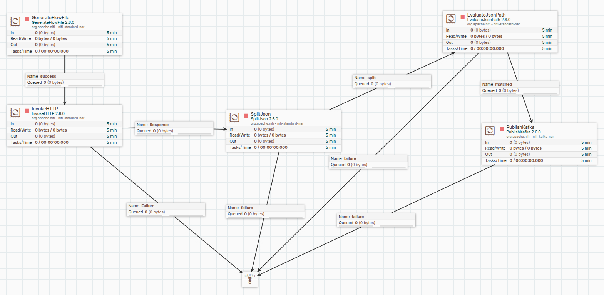
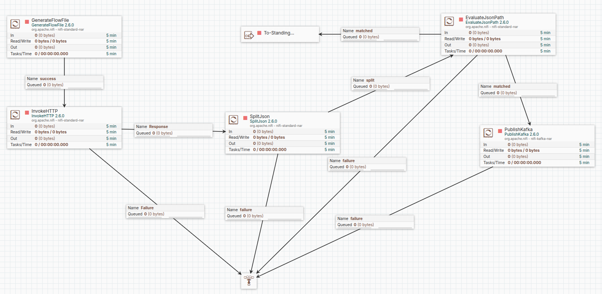
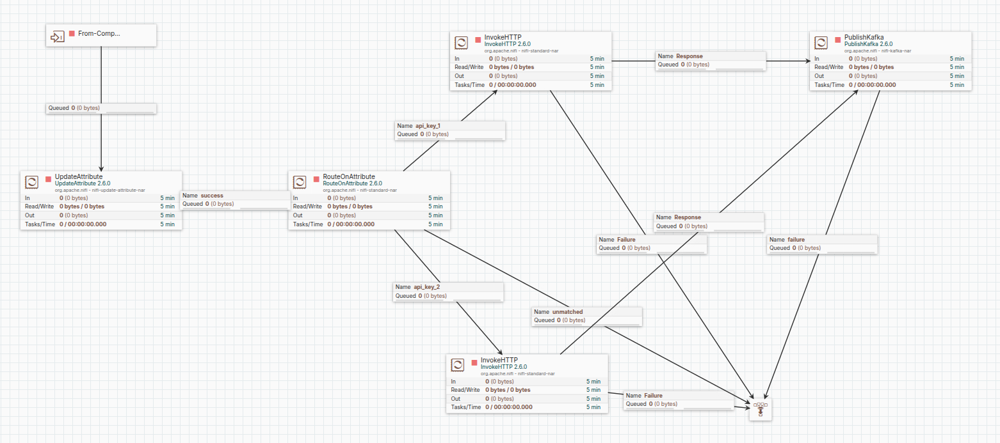
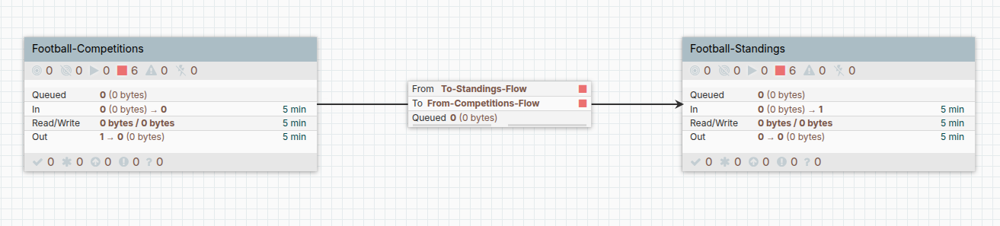
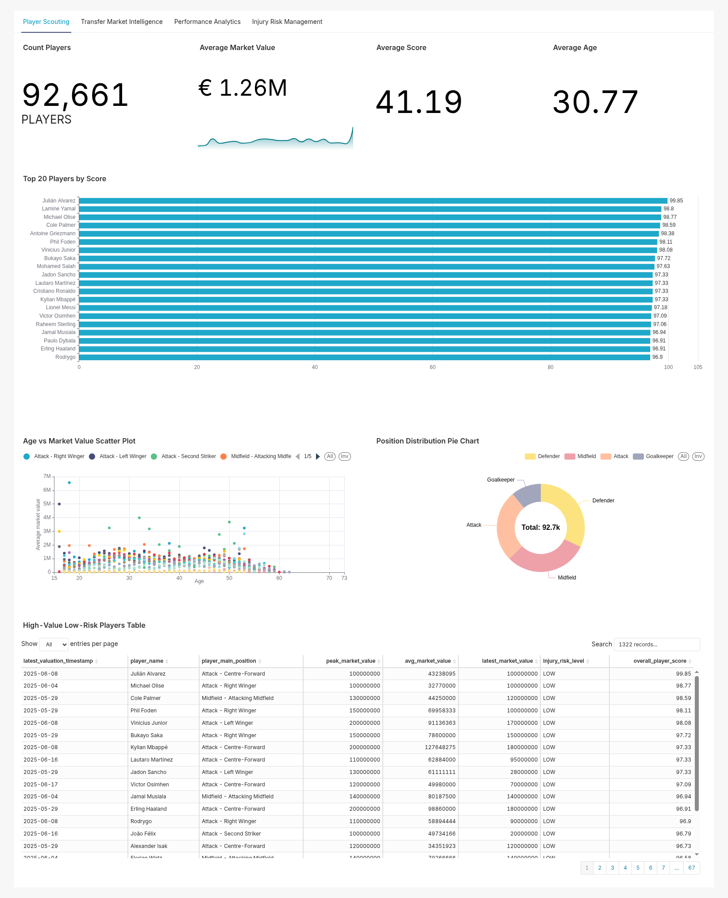
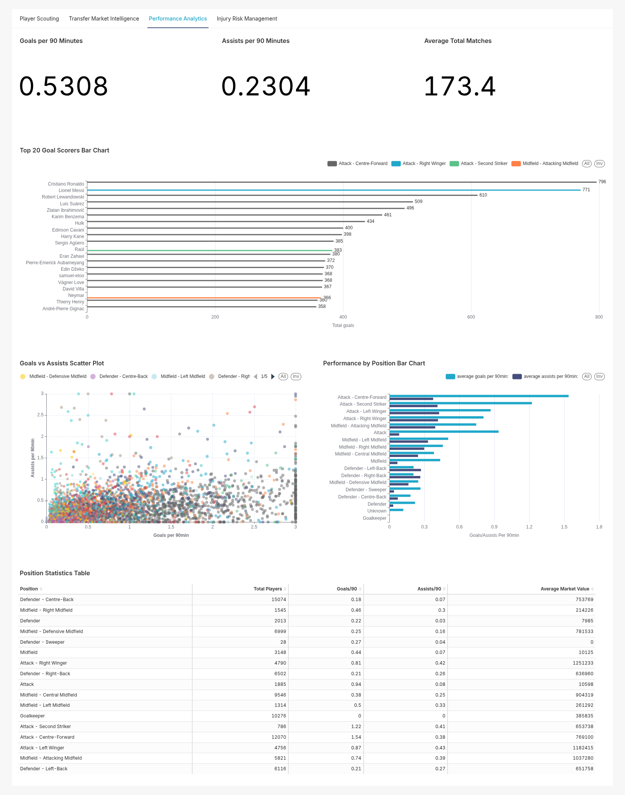
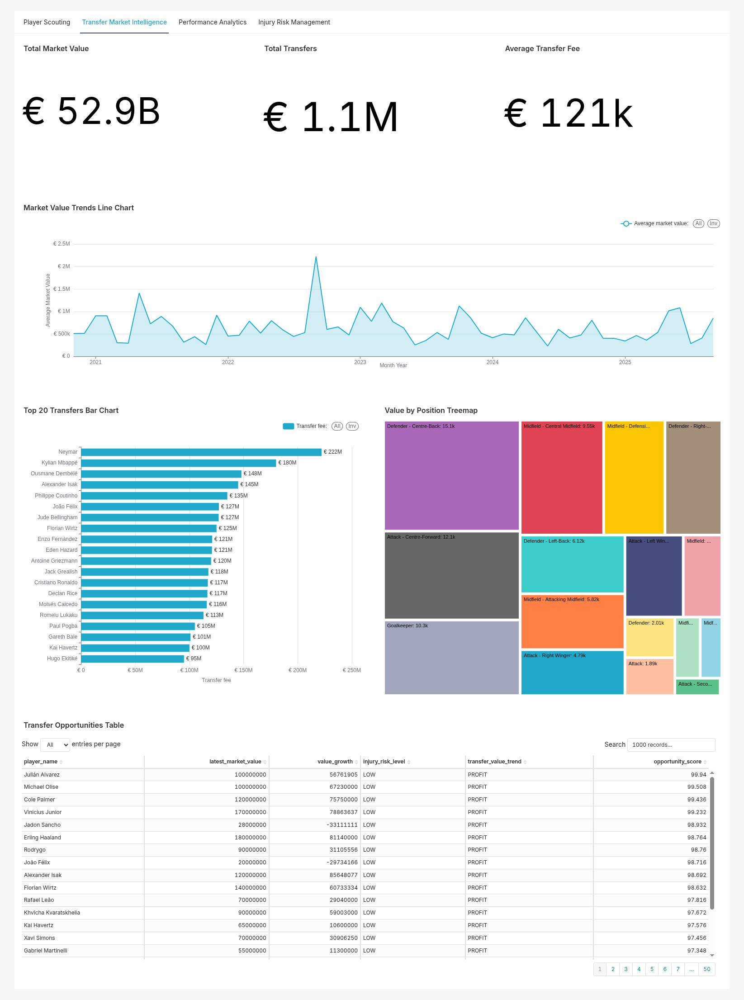
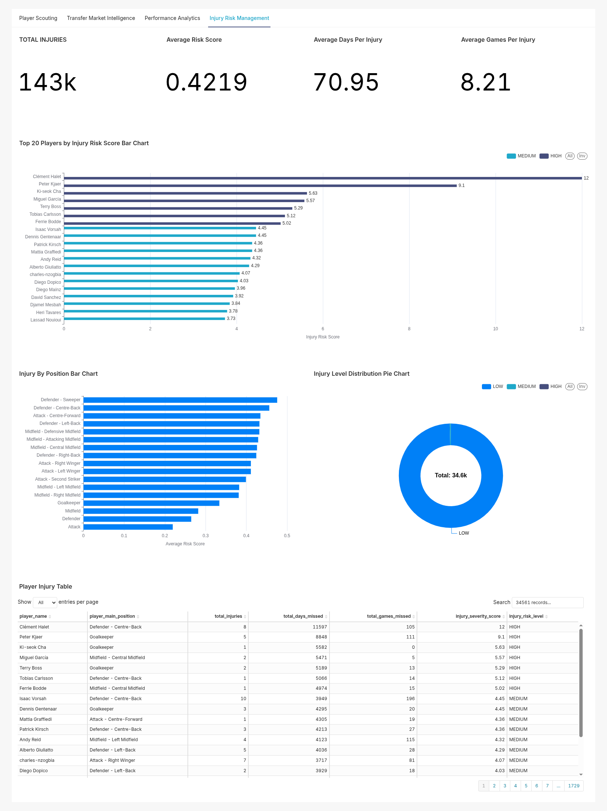
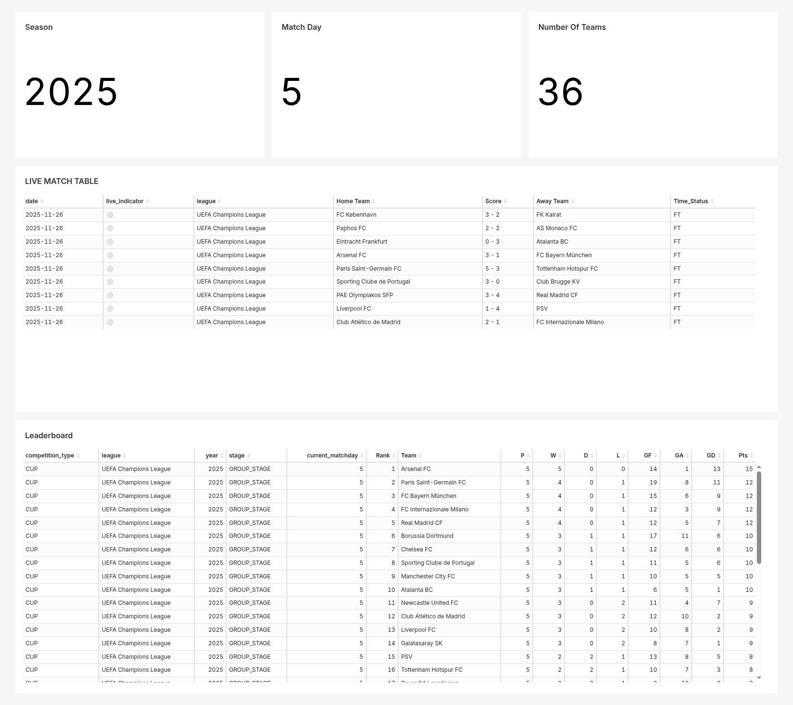
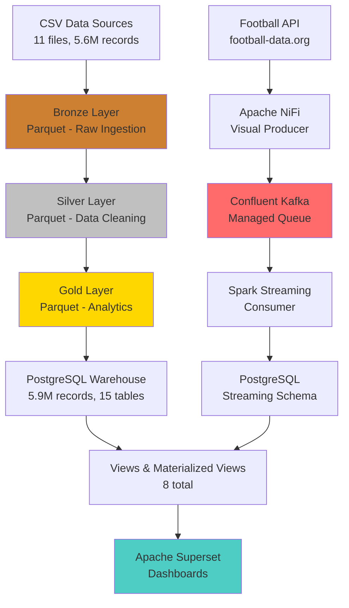

# ⚽ Football Big Data Analytics Platform

[](https://www.python.org/downloads/)
[](https://spark.apache.org/)
[](https://www.postgresql.org/)
[](LICENSE)

A **production-ready Big Data analytics platform** for football data with **batch ETL** (5.6M+ records) and **real-time streaming** (Kafka + Spark) pipelines. Features **Medallion architecture** (Bronze → Silver → Gold), **Apache NiFi** visual data flows, and **Apache Superset** dashboards.

---

## 📌 Table of Contents

- [✨ Key Features](#-key-features)
- [📦 Dataset](#-dataset)
- [🏗️ Architecture](#️-architecture)
- [🚀 Quick Start](#-quick-start)
- [📊 Data Overview](#-data-overview)
- [💻 Sample Queries](#-sample-queries)
- [🛠️ Tech Stack](#️-tech-stack)
- [📁 Project Structure](#-project-structure)
- [📚 Documentation](#-documentation)
- [🔧 Configuration](#-configuration)
- [📈 Performance](#-performance)
- [🎯 Use Cases](#-use-cases)

---

## ✨ Key Features

### **🥉 Batch Processing (ETL Pipeline)**
- ✅ **Medallion Architecture**: Bronze (raw) → Silver (cleaned) → Gold (analytics)
- ✅ **5.6M+ Records**: Player profiles, performances, transfers, injuries, market values
- ✅ **11 Data Sources**: CSV files from Transfermarkt dataset
- ✅ **Parquet Storage**: Optimized columnar format for analytics
- ✅ **PostgreSQL Integration**: 15 tables, 5.9M records, 50+ indexes
- ✅ **Data Quality Validation**: 8 automated quality checks
- ✅ **Views & Materialized Views**: 5 views + 3 materialized views
- ✅ **One Command Execution**: `python run_pipeline.py` (~2.5 minutes)

### **🔴 Real-Time Streaming Pipeline**
- ✅ **Apache NiFi Producer**: Visual data flow from Football-Data.org API
- ✅ **Confluent Cloud Kafka**: Managed message queue (SASL/SSL)
- ✅ **Spark Structured Streaming**: 30-second microbatch processing
- ✅ **Live Match Updates**: Real-time scores, events, statistics
- ✅ **UPSERT Logic**: Incremental updates to PostgreSQL
- ✅ **HYBRID Schema**: JSONB for flexible event storage

#### **Apache NiFi Data Flows**

<table>
  <tr>
    <td align="center">
      <br />
      <b>Live Matches Flow</b><br />
      Fetch match events every 10s → Kafka
    </td>
    <td align="center">
      <br />
      <b>Live Competitions Flow</b><br />
      Fetch competitions every 60s → Kafka
    </td>
  </tr>
  <tr>
    <td align="center">
      <br />
      <b>Live Leaderboards Flow</b><br />
      Fetch leaderboards every 60s → Kafka
    </td>
    <td align="center">
      <br />
      <b>Competitions → Leaderboards</b><br />
      Parse competition IDs for leaderboard fetching
    </td>
  </tr>
</table>

### **📊 Analytics & Visualization**
- ✅ **5 Gold Analytics Tables**: 403K records with comprehensive metrics
- ✅ **Player 360° Profiles**: Overall scores, form metrics, market trends
- ✅ **Injury Risk Analysis**: Health scores and availability predictions
- ✅ **Transfer Intelligence**: Market value trends and opportunities
- ✅ **Apache Superset Dashboards**: Interactive visualizations

#### **Dashboard Screenshots**

<table>
  <tr>
    <td align="center">
      <br />
      <b>Player Scouting</b><br />
      Top performers analysis by position and metrics
    </td>
    <td align="center">
      <br />
      <b>Performance Analytics</b><br />
      Player form metrics and statistical trends
    </td>
  </tr>
  <tr>
    <td align="center">
      <br />
      <b>Transfer Market Intelligence</b><br />
      Market value trends and transfer opportunities
    </td>
    <td align="center">
      <br />
      <b>Injury Risk Management</b><br />
      Health scores and injury history analysis
    </td>
  </tr>
  <tr>
    <td align="center" colspan="2">
      <br />
      <b>Football Leaderboards</b><br />
      Competition standings and team rankings
    </td>
  </tr>
</table>

### **🔒 Security & Best Practices**
- ✅ **Environment Variables**: All credentials in `.env` (gitignored)
- ✅ **No Hardcoded Secrets**: 100% secure configuration
- ✅ **Template File**: `.env.sample` for easy setup
- ✅ **Production Ready**: Tested with real data

---

## 📦 Dataset

🔗 **Download Dataset**: [Google Drive - Football Analytics Dataset](https://drive.google.com/drive/folders/1ha8wBkS4s1vzXKt94CD_roIAgKE3A3yG?usp=sharing)

- **11 CSV files** from Transfermarkt
- **5.6M+ records** of football data
- **Player profiles, performances, transfers, injuries, market values**
- Place downloaded files in `football-datasets/datalake/transfermarkt/` directory

---

## 🏗️ Architecture

### **System Overview**



### **Data Flow**

```
┌─────────────────────────────────────────────────────────────────┐
│                        BATCH PIPELINE                            │
├─────────────────────────────────────────────────────────────────┤
│  CSV (11 files)  →  Bronze  →  Silver  →  Gold  →  PostgreSQL   │
│    5.6M records      Parquet    Cleaned    Analytics   15 tables│
│                                                                  │
│  Runtime: ~2.5 minutes | Storage: 800 MB Parquet + 935 MB DB   │
└─────────────────────────────────────────────────────────────────┘

┌─────────────────────────────────────────────────────────────────┐
│                     STREAMING PIPELINE                           │
├─────────────────────────────────────────────────────────────────┤
│  API → NiFi → Kafka → Spark Streaming → PostgreSQL → Superset   │
│                                                                  │
│  Latency: 15-60s microbatch | Format: JSONB | Auth: SASL/SSL   │
└─────────────────────────────────────────────────────────────────┘
```

### **Streaming Data Flow Details**

**1. Match Events Streaming** (Real-time match updates)
```
Football-Data.org API
    ↓ (Every 10 seconds)
Apache NiFi InvokeHTTP Processor
    ↓ (Parse JSON, Route by status)
Kafka Topic: live-match-events
    ↓ (Consume with 15s trigger)
Spark Structured Streaming
    ↓ (UPSERT logic with JSONB)
PostgreSQL: streaming.football_matches
    ↓ (Query via views)
Apache Superset Dashboards
```

**2. Competitions & Leaderboards Streaming** (Tournament standings)
```
Football-Data.org API
    ↓ (Every 60 seconds)
Apache NiFi InvokeHTTP Processor
    ↓ (Parse competitions, extract IDs)
Kafka Topics: football-competitions, football-leaderboards
    ↓ (Consume with 60s trigger)
Spark Structured Streaming
    ↓ (UPSERT logic with separate tables)
PostgreSQL: streaming.competitions, streaming.leaderboards
    ↓ (Join with matches for complete view)
Apache Superset Dashboards
```

---

## 🚀 Quick Start

### **Prerequisites**
- Python 3.11+
- PostgreSQL 14+
- Apache Spark 4.0 (auto-installed via PySpark)
- Apache NiFi 1.25.0 (optional, for streaming)
- Apache Superset 3.0.0 (optional, for dashboards)

### **1. Environment Setup**

```bash
# Clone repository
git clone https://github.com/Flourish04/football_bigdata_analysis.git
cd football_project

# Create environment file
cp .env.sample .env

# Edit .env and add your credentials
nano .env
```

**Required Environment Variables:**
```bash
# PostgreSQL Configuration
POSTGRES_HOST=localhost
POSTGRES_PORT=5432
POSTGRES_DB=football_analytics
POSTGRES_USER=postgres
POSTGRES_PASSWORD=your_postgres_password

# Kafka Configuration (for streaming)
KAFKA_BOOTSTRAP_SERVERS=pkc-xxx.aws.confluent.cloud:9092
KAFKA_API_KEY=your_kafka_api_key
KAFKA_API_SECRET=your_kafka_api_secret
KAFKA_TOPIC=live-match-events
KAFKA_TOPIC_COMPETITIONS=football-competitions
KAFKA_TOPIC_LEADERBOARDS=football-leaderboards

# Football API (for streaming)
FOOTBALL_API_TOKEN=your_football_api_token
```

### **2. Install Dependencies**

```bash
# Install Python packages
pip install -r requirements.txt

# For streaming (optional)
pip install -r requirements-streaming.txt
```

### **3. Run Batch Pipeline**

```bash
# Execute full ETL pipeline
python run_pipeline.py
```

**Expected Output:**
```
╔════════════════════════════════════════════════════════════╗
║              FOOTBALL DATA ETL PIPELINE                    ║
╚════════════════════════════════════════════════════════════╝

[1/7] 🥉 Running Bronze Layer...
✅ Bronze Layer Complete: 5,605,055 records in 52.3s

[2/7] 🥈 Running Silver Layer...
✅ Silver Layer Complete: 5,535,614 records in 25.1s

[3/7] 🥇 Running Gold Layer...
✅ Gold Layer Complete: 402,992 records in 11.2s

[4/7] 📊 Loading Silver to PostgreSQL...
✅ Silver loaded: 68,117 records in 13.4s

[5/7] 📊 Loading Gold to PostgreSQL...
✅ Gold loaded: 402,992 records in 32.8s

[6/7] 🔍 Creating Views...
✅ Views created: 5 views in 0.2s

[7/7] ✅ Data Quality Validation...
✅ All validation checks passed!

╔════════════════════════════════════════════════════════════╗
║  PIPELINE COMPLETED SUCCESSFULLY IN 148.7 SECONDS          ║
╚════════════════════════════════════════════════════════════╝
```

### **4. Run Streaming Pipeline (Optional)**

#### **Match Events Streaming** (NiFi pushes every 10s, Spark processes every 15s)
```bash
# Start match events streaming consumer
python src/streaming/spark_streaming_upsert.py

# Press Ctrl+C to stop gracefully
```

#### **Competitions & Leaderboards Streaming** (NiFi pushes every 60s, Spark processes every 60s)
```bash
# Start competitions streaming consumer
python src/streaming/spark_streaming_competitions.py

# Press Ctrl+C to stop gracefully
```

**Streaming Features:**
- ✅ **Global Checkpoint Config**: Auto-generates run IDs (UUIDs) per restart → Batch ID resets to 0
- ✅ **Trigger Intervals**: Matches (15s), Competitions (60s) aligned with NiFi frequencies
- ✅ **JSONB Storage**: Flexible schema for live match events, competitions, leaderboards
- ✅ **UPSERT Logic**: Incremental updates to PostgreSQL (no duplicates)
- ✅ **Backpressure Handling**: `maxOffsetsPerTrigger` prevents Spark overload

**See [STREAMING_ARCHITECTURE.md](STREAMING_ARCHITECTURE.md) for complete streaming setup.**

---

## 📊 Data Overview

### **📦 Gold Analytics Tables (PostgreSQL)**

| Table | Records | Description |
|-------|---------|-------------|
| `player_analytics_360` | 92,671 | **360° player profiles**: Overall scores, peak values, career stats |
| `player_form_metrics` | 88,375 | **Performance metrics**: Goals, assists, per-90min rates |
| `market_value_trends` | 69,441 | **Market analysis**: Value trends, volatility, growth rates |
| `injury_risk_scores` | 34,561 | **Health analytics**: Injury history, risk scores, availability |
| `transfer_intelligence` | 117,944 | **Transfer insights**: Market intelligence, fee analysis |

### **🥈 Silver Layer Tables (PostgreSQL)**

| Table | Records | Description |
|-------|---------|-------------|
| `player_profiles` | 92,671 | Cleaned player biographical data |
| `player_performances` | 4,965,850 | Match performance records |
| `player_market_value` | 248,175 | Historical market valuations |
| `transfer_history` | 117,944 | Transfer records |
| `player_injuries` | 34,561 | Injury history |
| `team_details` | 862 | Team information |
| `competition_details` | 59 | Competition metadata |
| ... | ... | 10 tables total |

### **🔴 Streaming Tables (PostgreSQL)**

| Table | Description | Schema |
|-------|-------------|--------|
| `football_matches` | Real-time live match updates | HYBRID (structured + JSONB) |

### **🔍 Views & Materialized Views**

| Type | Name | Description |
|------|------|-------------|
| View | `vw_top_players` | Top 100 players by overall score |
| View | `vw_high_value_low_risk_players` | High-value players with low injury risk |
| View | `vw_transfer_opportunities` | Best transfer targets |
| View | `vw_current_live_matches` | Currently live matches (streaming) |
| View | `vw_match_score_progression` | Score progression timeline (streaming) |
| Materialized | `mvw_position_statistics` | Aggregated stats by position |
| Materialized | `mvw_age_group_analysis` | Player statistics by age groups |
| Materialized | `mvw_league_statistics` | League-level aggregated statistics |

---

## 💻 Sample Queries

### **Top 10 Players Overall**

```sql
SELECT 
    player_name,
    overall_player_score,
    peak_market_value,
    current_team,
    position
FROM analytics.player_analytics_360
ORDER BY overall_player_score DESC
LIMIT 10;
```

### **High-Value Low-Risk Players**

```sql
SELECT 
    player_name,
    current_market_value,
    injury_risk_score,
    total_injuries,
    position
FROM analytics.vw_high_value_low_risk_players
WHERE current_market_value > 10000000
ORDER BY overall_player_score DESC
LIMIT 20;
```

### **Market Value Trends**

```sql
SELECT 
    player_name,
    current_market_value,
    value_change_1y,
    value_change_3y,
    volatility_score
FROM analytics.market_value_trends
WHERE value_change_1y > 5000000
ORDER BY value_change_1y DESC;
```

### **Live Matches (Streaming)**

```sql
SELECT 
    competition_name,
    home_team_name || ' ' || ft_home_goals || '-' || ft_away_goals || ' ' || away_team_name AS match,
    status,
    minute
FROM streaming.football_matches
WHERE status = 'IN_PLAY'
ORDER BY updated_at DESC;
```

### **Position Statistics (Materialized View)**

```sql
SELECT 
    position,
    total_players,
    avg_market_value,
    avg_goals_per_90,
    avg_assists_per_90
FROM analytics.mvw_position_statistics
ORDER BY total_players DESC;
```

---

## 🛠️ Tech Stack

### **Batch Processing**
- **Language**: Python 3.11+
- **Big Data**: Apache Spark 4.0.0 (PySpark)
- **Database**: PostgreSQL 14+
- **Storage**: Parquet (columnar format)
- **Libraries**: pandas, psycopg2, pyspark

### **Real-Time Streaming**
- **Producer**: Apache NiFi 1.25.0 (visual ETL)
- **Message Queue**: Confluent Cloud Kafka (managed)
- **Consumer**: Spark Structured Streaming
- **Format**: JSONB (flexible schema)
- **Authentication**: SASL/SSL

### **Visualization**
- **Dashboard**: Apache Superset 3.0.0
- **Charts**: Bar, Line, Pie, Heatmap, Table
- **Refresh**: Real-time (streaming) + Scheduled (batch)

### **Infrastructure**
- **Deployment**: Local installation (production-ready)
- **Version Control**: Git + GitHub
- **Security**: Environment variables, no hardcoded secrets
- **Data Volume**: 5.9M records, ~1.7 GB total

---

## 📁 Project Structure

```
football_project/
├── run_pipeline.py                 # 🚀 Main ETL orchestrator
├── validate_data.py                # ✅ Data quality validation
├── .env                            # 🔒 Credentials (gitignored)
├── .env.sample                     # 📋 Template for .env
├── requirements.txt                # 📦 Python dependencies
├── requirements-streaming.txt      # 📦 Streaming dependencies
│
├── src/                            # 💻 Source code
│   ├── bronze_layer.py            # 🥉 CSV → Parquet ingestion
│   ├── silver_layer.py            # 🥈 Data cleaning & standardization
│   ├── gold_layer.py              # 🥇 Analytics aggregation
│   ├── data_quality_check.py      # ✅ Quality checks
│   └── streaming/                 # 🔴 Streaming pipeline
│       ├── spark_streaming_upsert.py         # Match events (15s trigger)
│       └── spark_streaming_competitions.py   # Competitions/Leaderboards (60s trigger)
│
├── schema/                         # 🗄️ Database schemas
│   ├── analytics_schema.sql       # Gold layer DDL
│   ├── streaming_schema.sql       # Streaming schema DDL
│   ├── create_views_only.sql      # Views & materialized views
│   ├── create_views.py            # View creation script
│   ├── load_silver_to_postgres.py # Silver data loader
│   └── load_gold_to_postgres.py   # Gold data loader
│
├── football-datasets/              # 📊 Source data (5.6M records)
│   └── datalake/transfermarkt/    # Transfermarkt CSV files
│
├── jars/                           # ☕ Java dependencies
│   └── postgresql-42.7.1.jar      # PostgreSQL JDBC driver
│
└── docs/                           # 📚 Documentation
    ├── PROJECT_OVERVIEW.md         # Complete system docs
    ├── STREAMING_ARCHITECTURE.md   # Streaming design
    ├── DATA_QUALITY.md             # Quality rules
    └── CONFLUENT_CLOUD_SETUP.md    # Kafka setup guide
```

---

## 📚 Documentation

### **📖 Getting Started**
- [README.md](README.md) - **This file** (overview + quick start)
- [PROJECT_OVERVIEW.md](PROJECT_OVERVIEW.md) - **Complete system documentation** (667 lines)
- [BAO_CAO_TONG_QUAN.md](BAO_CAO_TONG_QUAN.md) - **Báo cáo dự án tiếng Việt** (Vietnamese report)

### **📊 Database & Architecture Diagrams**
- [diagrams/DATABASE_SCHEMA.md](diagrams/DATABASE_SCHEMA.md) - **Complete ERD diagrams** (Silver, Gold, Streaming schemas)
- [diagrams/SYSTEM_ARCHITECTURE.md](diagrams/SYSTEM_ARCHITECTURE.md) - **System architecture diagrams** (Lambda, Medallion, ETL flows)

### **🔴 Streaming Setup**
- [STREAMING_ARCHITECTURE.md](STREAMING_ARCHITECTURE.md) - Architecture overview (428 lines)
- [CONFLUENT_CLOUD_SETUP.md](CONFLUENT_CLOUD_SETUP.md) - Kafka configuration

### **✅ Data Quality**
- [DATA_QUALITY.md](DATA_QUALITY.md) - Quality rules and validation

---

## 🔧 Configuration

### **Database Connection (Python)**

```python
import psycopg2
import os
from dotenv import load_dotenv

# Load environment variables
load_dotenv()

# Connect to PostgreSQL
conn = psycopg2.connect(
    host=os.getenv('POSTGRES_HOST', 'localhost'),
    port=os.getenv('POSTGRES_PORT', 5432),
    database=os.getenv('POSTGRES_DB', 'football_analytics'),
    user=os.getenv('POSTGRES_USER', 'postgres'),
    password=os.getenv('POSTGRES_PASSWORD')
)
```

### **Kafka Configuration (Streaming)**

```python
# Kafka connection settings
kafka_config = {
    'kafka.bootstrap.servers': os.getenv('KAFKA_BOOTSTRAP_SERVERS'),
    'kafka.security.protocol': 'SASL_SSL',
    'kafka.sasl.mechanism': 'PLAIN',
    'kafka.sasl.jaas.config': f'''org.apache.kafka.common.security.plain.PlainLoginModule required 
        username="{os.getenv('KAFKA_API_KEY')}" 
        password="{os.getenv('KAFKA_API_SECRET')}";''',
    'subscribe': os.getenv('KAFKA_TOPIC', 'live-match-events')
}
```

---

## 📈 Performance

### **Batch Pipeline Metrics**

| Layer | Duration | Records | Throughput |
|-------|----------|---------|------------|
| 🥉 Bronze | 52s | 5,605,055 | 107,789 rec/s |
| 🥈 Silver | 25s | 5,535,614 | 221,424 rec/s |
| 🥇 Gold | 11s | 402,992 | 36,635 rec/s |
| 📊 Load Silver | 13s | 68,117 | 5,240 rec/s |
| 📊 Load Gold | 33s | 402,992 | 12,212 rec/s |
| 🔍 Views | 0.2s | 5 views | - |
| ✅ Validation | 10s | 8 checks | - |
| **⏱️ Total** | **~2.5 min** | **5.9M** | **39,333 rec/s avg** |

### **Streaming Pipeline Metrics**

| Metric | Value |
|--------|-------|
| Microbatch Interval | 30 seconds |
| Latency | < 1 minute (end-to-end) |
| Throughput | 17 matches/batch (average) |
| Write Mode | UPSERT (incremental) |
| Format | JSONB (flexible schema) |

### **Storage Metrics**

| Component | Size | Format |
|-----------|------|--------|
| Bronze Layer | 320 MB | Parquet |
| Silver Layer | 280 MB | Parquet |
| Gold Layer | 180 MB | Parquet |
| PostgreSQL DB | 935 MB | Relational |
| **Total** | **1.7 GB** | - |

---

## 🎯 Use Cases

### **⚽ Player Scouting**
- Identify top performers by position, age, and market value
- Compare players across leagues and seasons
- Filter by specific metrics (goals/90, assists/90, etc.)

### **💰 Transfer Market Analysis**
- Find undervalued players with positive value trends
- Track market value volatility and growth rates
- Analyze transfer fees and patterns

### **🏥 Injury Risk Assessment**
- Evaluate player health and availability
- Calculate injury risk scores
- Monitor injury history and recovery times

### **📊 Performance Analytics**
- Track player form and consistency
- Compare performance metrics across seasons
- Identify emerging talents

### **🔴 Real-Time Monitoring**
- Monitor live matches as they happen
- Track real-time statistics and events
- Build interactive dashboards with Apache Superset

---

## 📸 Screenshots & Visualizations

### **Apache Superset Dashboards**

Our platform includes 5 comprehensive dashboards built with Apache Superset for data visualization and analysis:

#### **1. Player Scouting Dashboard**

*Identify top performers with detailed metrics across positions, leagues, and age groups. Features interactive filters for market value, overall score, and performance indicators.*

#### **2. Performance Analytics Dashboard**

*Track player form metrics, goals/assists trends, and statistical comparisons. Includes per-90 minute rates and consistency scores.*

#### **3. Transfer Market Intelligence Dashboard**

*Analyze market value trends, identify undervalued players, and track transfer opportunities. Features value change percentages and volatility indicators.*

#### **4. Injury Risk Management Dashboard**

*Monitor player health scores, injury history, and availability predictions. Helps with squad rotation and injury prevention strategies.*

#### **5. Football Leaderboards Dashboard**

*View competition standings, team rankings, and real-time tournament tables. Integrates streaming data for live updates.*

---

### **Apache NiFi Data Flow Processors**

Visual ETL flows designed in Apache NiFi for streaming data ingestion:

#### **Live Match Events Flow**

*InvokeHTTP processor fetches match data every 10 seconds from Football-Data.org API, routes by match status (IN_PLAY, FINISHED, SCHEDULED), and publishes to Kafka topic `live-match-events`.*

#### **Live Competitions Flow**

*Fetches competition metadata every 60 seconds, parses JSON structure, extracts competition IDs, and publishes to Kafka topic `football-competitions`.*

#### **Live Leaderboards Flow**

*Retrieves tournament standings every 60 seconds for each competition, parses team rankings and statistics, and publishes to Kafka topic `football-leaderboards`.*

#### **Competitions to Leaderboards Mapping**

*Intermediate processor that extracts competition IDs from the competitions flow and dynamically triggers leaderboard fetching for each tournament.*

---

## 🤝 Contributing

Contributions are welcome! Please feel free to submit a Pull Request.

---

## 📄 License

This project is for **educational and analytical purposes** only.

---

## 🙏 Acknowledgments

- **Data Source**: [Transfermarkt](https://www.transfermarkt.com/) football dataset
- **Architecture**: Medallion (Lakehouse) pattern
- **Inspiration**: Modern data engineering best practices

---

## 📞 Contact

For questions or feedback, please open an issue on [GitHub](https://github.com/Flourish04/football_bigdata_analysis).

---

<div align="center">

**Made with ⚽ + 🐍 + 🐘 + 🔥**

[](https://github.com/Flourish04/football_bigdata_analysis)

</div>
