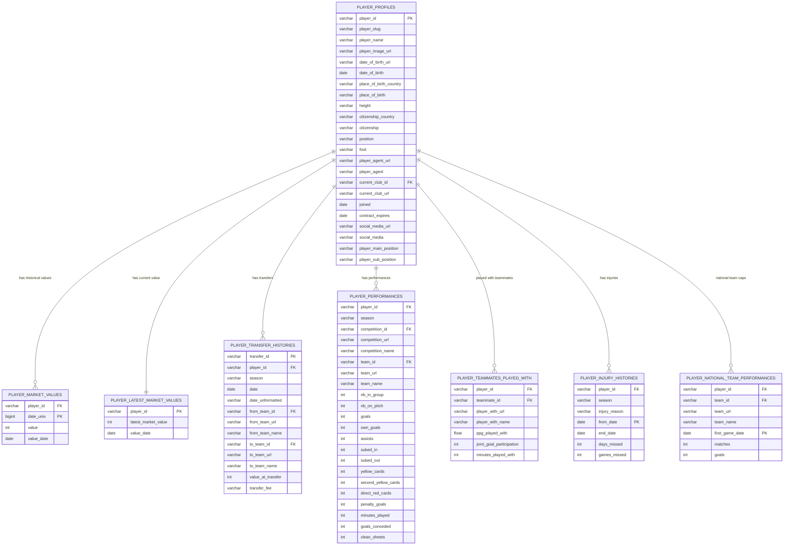
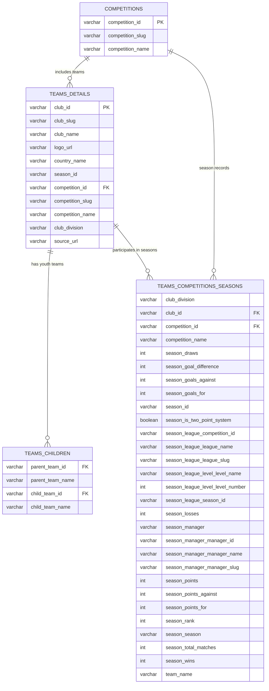
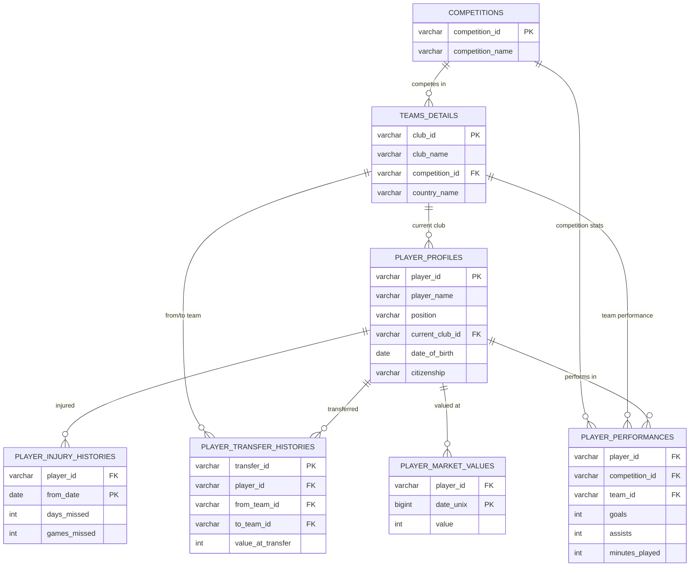
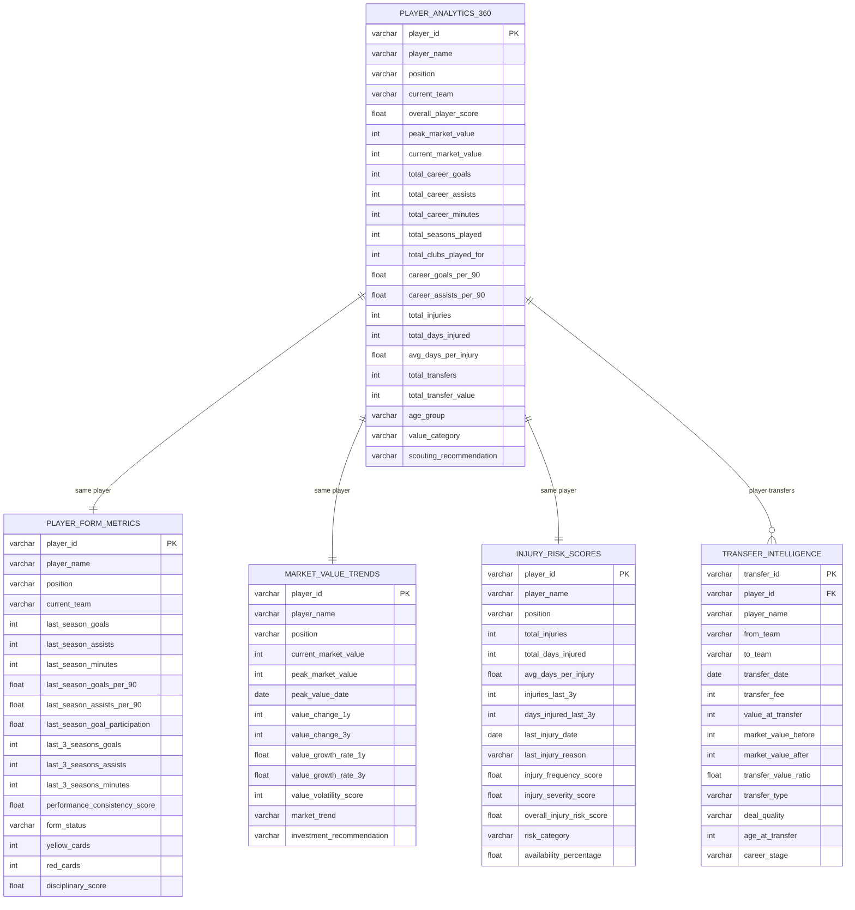
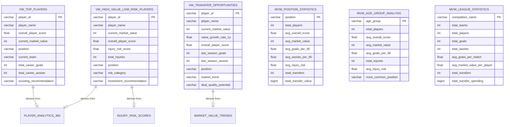
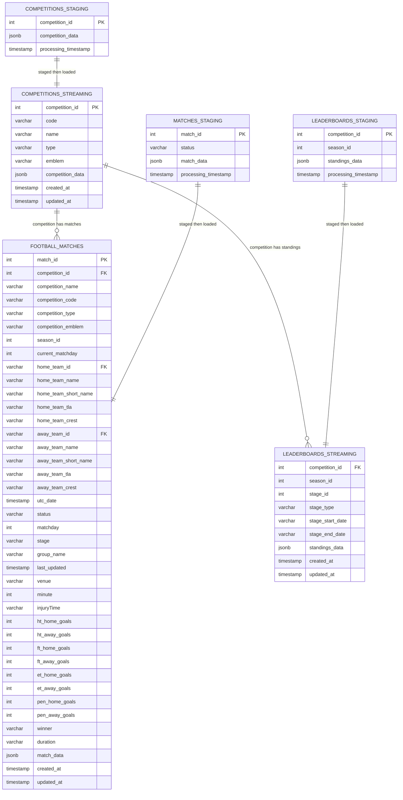
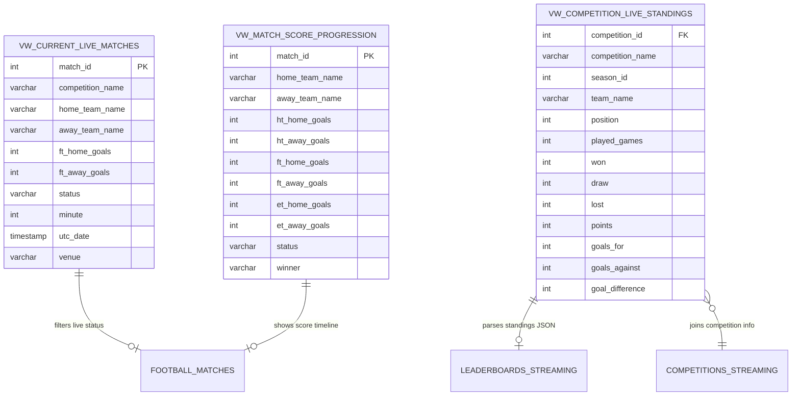
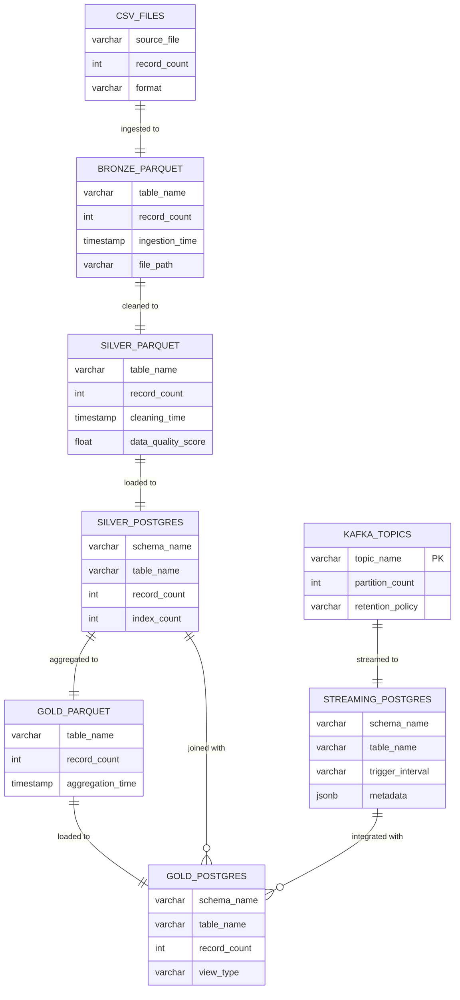
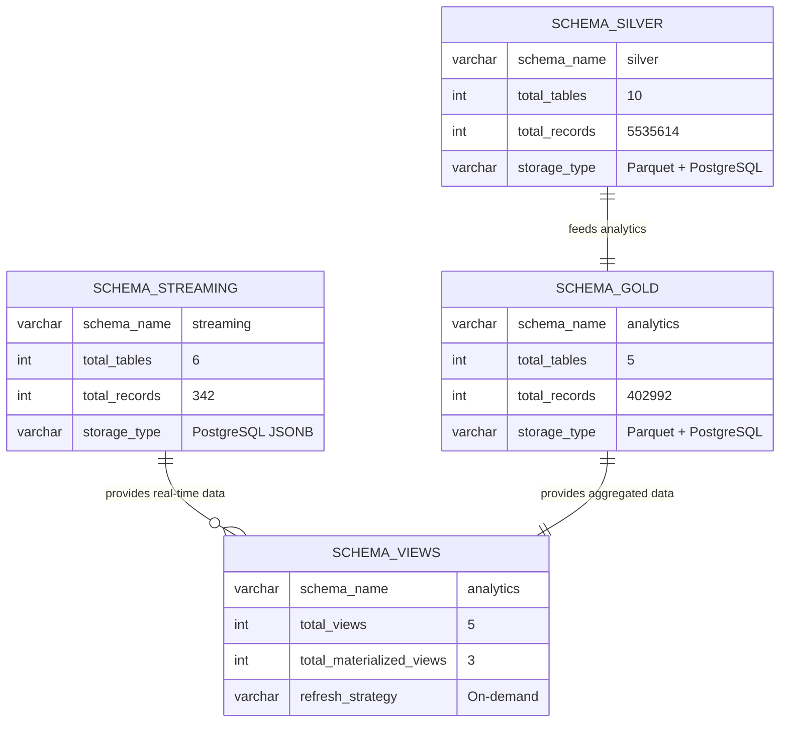
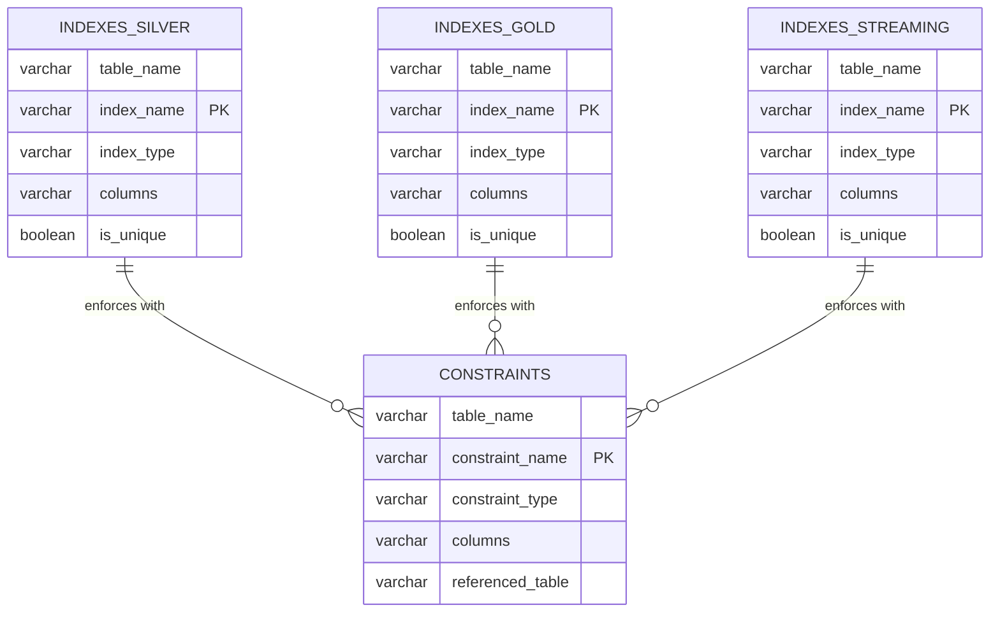

# 📊 Database Schema Diagrams

## Table of Contents
- [Silver Layer Schema](#silver-layer-schema)
- [Gold Layer Analytics Schema](#gold-layer-analytics-schema)
- [Streaming Schema](#streaming-schema)
- [Complete System Overview](#complete-system-overview)

---

## Silver Layer Schema

### Player-Related Tables



### Team and Competition Tables



### Integrated Silver Layer Schema



---

## Gold Layer Analytics Schema

### Analytics 360° Tables



### Analytics Views



---

## Streaming Schema

### Real-Time Streaming Tables



### Streaming Views



---

## Complete System Overview

### Data Flow Architecture



### Schema Organization



---

## Index and Constraint Overview

### Performance Optimization



---

## Summary Statistics

| Layer | Schema | Tables | Records | Indexes | Views | Storage |
|-------|--------|--------|---------|---------|-------|---------|
| **Bronze** | - | 11 | 5,605,055 | 0 | 0 | 320 MB Parquet |
| **Silver** | `silver` | 10 | 5,535,614 | 38 | 0 | 280 MB Parquet + 615 MB PG |
| **Gold** | `analytics` | 5 | 402,992 | 15 | 5 regular + 3 MV | 180 MB Parquet + 320 MB PG |
| **Streaming** | `streaming` | 6 | 342 | 9 | 3 | 12 MB PG JSONB |
| **Total** | - | **32** | **11,544,003** | **62** | **11** | **1.7 GB** |

---

## Database Connection Information

```yaml
# PostgreSQL Configuration
Host: localhost
Port: 5432
Database: football_analytics
Schemas:
  - silver        # Cleaned data (10 tables, 5.5M records)
  - analytics     # Analytics (5 tables, 403K records, 8 views)
  - streaming     # Real-time (6 tables, 342 records)

# Parquet Data Lake
Location: artifacts/
Layers:
  - bronze/       # Raw data (11 files, 5.6M records)
  - silver/       # Cleaned (10 files, 5.5M records)
  - gold/         # Analytics (5 files, 403K records)
```

---

*Generated: November 30, 2025*  
*Project: Football Big Data Analytics Platform*  
*Repository: github.com/Flourish04/football_bigdata_analysis*
