# 🏗️ System Architecture Diagrams

## Table of Contents
- [Lambda Architecture Overview](#lambda-architecture-overview)
- [Medallion Architecture Flow](#medallion-architecture-flow)
- [ETL Pipeline Flow](#etl-pipeline-flow)
- [Streaming Architecture](#streaming-architecture)
- [Component Integration](#component-integration)

---

## Lambda Architecture Overview

### High-Level System Architecture

---

## Medallion Architecture Flow

### Bronze → Silver → Gold Layers

---

## ETL Pipeline Flow

### Step-by-Step Execution

```mermaid
sequenceDiagram
    participant User
    participant Orchestrator as run_pipeline.py
    participant Bronze as bronze_layer.py
    participant Silver as silver_layer.py
    participant Gold as gold_layer.py
    participant Loader as PostgreSQL Loaders
    participant Views as View Creator
    participant Validator as Data Quality Check

    User->>Orchestrator: python run_pipeline.py
    
    Note over Orchestrator: Step 1/7: Bronze Layer
    Orchestrator->>Bronze: Execute Bronze Ingestion
    Bronze->>Bronze: Read 11 CSV files
    Bronze->>Bronze: Infer schemas
    Bronze->>Bronze: Add ingestion metadata
    Bronze->>Bronze: Write to Parquet (Snappy)
    Bronze-->>Orchestrator: ✅ 5,605,055 records (52s)

    Note over Orchestrator: Step 2/7: Silver Layer
    Orchestrator->>Silver: Execute Silver Cleaning
    Silver->>Silver: Read Bronze Parquet
    Silver->>Silver: Clean 10 tables
    Silver->>Silver: Standardize formats
    Silver->>Silver: Handle nulls & duplicates
    Silver->>Silver: Write to Parquet
    Silver-->>Orchestrator: ✅ 5,535,614 records (25s)

    Note over Orchestrator: Step 3/7: Gold Layer
    Orchestrator->>Gold: Execute Gold Aggregation
    Gold->>Gold: Read Silver data
    Gold->>Gold: Calculate 5 analytics tables
    Gold->>Gold: Player 360, Form, Market, Injury, Transfer
    Gold->>Gold: Write to Parquet
    Gold-->>Orchestrator: ✅ 402,992 records (11s)

    Note over Orchestrator: Step 4/7: Load Silver to PostgreSQL
    Orchestrator->>Loader: Load Silver Tables
    Loader->>Loader: Read Silver Parquet
    Loader->>Loader: Create tables with indexes
    Loader->>Loader: Bulk insert data
    Loader-->>Orchestrator: ✅ 5,535,614 records (13s)

    Note over Orchestrator: Step 5/7: Load Gold to PostgreSQL
    Orchestrator->>Loader: Load Gold Tables
    Loader->>Loader: Read Gold Parquet
    Loader->>Loader: Create analytics schema
    Loader->>Loader: Create tables & indexes
    Loader->>Loader: Bulk insert data
    Loader-->>Orchestrator: ✅ 402,992 records (33s)

    Note over Orchestrator: Step 6/7: Create Views
    Orchestrator->>Views: Create SQL Views
    Views->>Views: 5 Regular Views
    Views->>Views: 3 Materialized Views
    Views-->>Orchestrator: ✅ 8 views (0.2s)

    Note over Orchestrator: Step 7/7: Data Quality Validation
    Orchestrator->>Validator: Run Quality Checks
    Validator->>Validator: 8 validation rules
    Validator->>Validator: Check completeness
    Validator->>Validator: Check consistency
    Validator->>Validator: Check accuracy
    Validator-->>Orchestrator: ✅ All checks passed (10s)

    Orchestrator-->>User: ✅ Pipeline Complete (148.7s)
```

---

## Streaming Architecture

### Real-Time Data Pipeline

```mermaid
graph TB
    subgraph "DATA SOURCE"
        A[Football-Data.org API<br/>REST API with Auth Token]
    end

    subgraph "APACHE NIFI PRODUCERS"
        B1[InvokeHTTP<br/>Fetch Matches<br/>Every 10s]
        B2[InvokeHTTP<br/>Fetch Competitions<br/>Every 60s]
        B3[InvokeHTTP<br/>Fetch Leaderboards<br/>Every 60s]
        B4[RouteOnAttribute<br/>Filter by Status]
        B5[EvaluateJsonPath<br/>Extract Competition IDs]
    end

    subgraph "CONFLUENT KAFKA TOPICS"
        C1[live-match-events<br/>Partition: 3<br/>Retention: 7 days]
        C2[football-competitions<br/>Partition: 1<br/>Retention: 30 days]
        C3[football-leaderboards<br/>Partition: 1<br/>Retention: 30 days]
    end

    subgraph "SPARK STREAMING CONSUMERS"
        D1[Match Events Consumer<br/>Trigger: 15s<br/>Checkpoint: Global]
        D2[Competitions Consumer<br/>Trigger: 60s<br/>Checkpoint: Global]
    end

    subgraph "STAGING TABLES"
        E1[matches_staging<br/>Temporary Buffer]
        E2[competitions_staging<br/>Temporary Buffer]
        E3[leaderboards_staging<br/>Temporary Buffer]
    end

    subgraph "POSTGRESQL TABLES"
        F1[streaming.football_matches<br/>JSONB + Structured]
        F2[streaming.competitions<br/>JSONB Metadata]
        F3[streaming.leaderboards<br/>JSONB Standings]
    end

    subgraph "VIEWS"
        G1[vw_current_live_matches]
        G2[vw_match_score_progression]
        G3[vw_competition_live_standings]
    end

    A --> B1
    A --> B2
    A --> B3
    B1 --> B4
    B4 --> C1
    B2 --> B5
    B5 --> C2
    B3 --> C3

    C1 --> D1
    C2 --> D2
    C3 --> D2

    D1 --> E1
    D2 --> E2
    D2 --> E3

    E1 --> F1
    E2 --> F2
    E3 --> F3

    F1 --> G1
    F1 --> G2
    F2 --> G3
    F3 --> G3

    style C1 fill:#ff6b6b
    style C2 fill:#ff6b6b
    style C3 fill:#ff6b6b
    style F1 fill:#4ecdc4
    style G1 fill:#95e1d3
```

### Streaming Data Flow Detail

---

## Component Integration

### Technology Stack Integration

### Data Flow Volume Metrics

---

## Performance Metrics Dashboard

### Pipeline Execution Metrics

### Storage Distribution

### Record Distribution by Layer

---

## Deployment Architecture

### Local Development Setup

---

## Summary Statistics

### System Metrics Overview

| Metric | Value | Description |
|--------|-------|-------------|
| **Total Records Processed** | 11,544,003 | Across all layers |
| **Pipeline Runtime** | 148.7 seconds | Full ETL execution |
| **Storage Footprint** | 1.7 GB | Parquet + PostgreSQL |
| **Data Quality Score** | 98.8% | After cleaning |
| **Throughput** | 39,333 rec/s | Average processing rate |
| **Streaming Latency** | 15-60 seconds | Microbatch interval |
| **Tables Created** | 32 | Across 3 schemas |
| **Indexes Created** | 62 | Performance optimization |
| **Views Created** | 11 | 8 regular + 3 materialized |

### Layer-by-Layer Breakdown

| Layer | Duration | Records | Throughput | Storage | Data Loss |
|-------|----------|---------|------------|---------|-----------|
| Bronze | 52s | 5,605,055 | 107,789/s | 320 MB | 0.002% |
| Silver | 25s | 5,535,614 | 221,424/s | 280 MB | 1.2% |
| Gold | 11s | 402,992 | 36,635/s | 180 MB | N/A |
| Load Silver | 13s | 5,535,614 | 425,816/s | 615 MB | 0% |
| Load Gold | 33s | 402,992 | 12,212/s | 320 MB | 0% |
| Streaming | Real-time | 342 | N/A | 12 MB | 0% |

---

*Generated: November 30, 2025*  
*Project: Football Big Data Analytics Platform*  
*Repository: github.com/Flourish04/football_bigdata_analysis*
